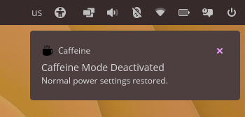
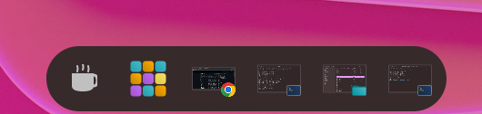
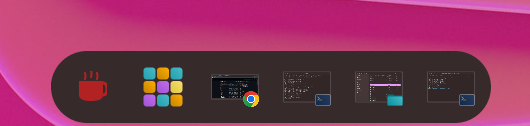
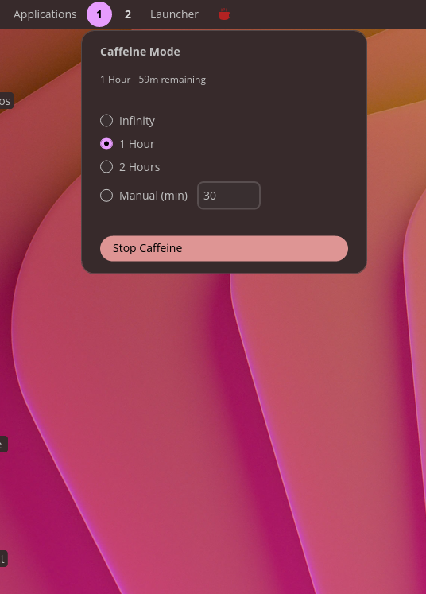
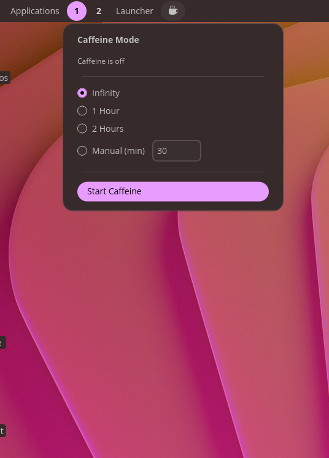

# Caffeine for COSMIC

A native Rust applet for the COSMIC Desktop Environment that prevents your system from going to sleep. Perfect for presentations, watching videos, or any time you need your screen to stay awake.

## What Does It Do?

When activated, Caffeine prevents your computer from:
- Turning off the display
- Going to sleep or suspend mode
- Activating the screensaver

The applet sits in your panel and shows a coffee cup icon. Click it to toggle caffeine mode on or off.

## Gallery

<p align="center">
  
  
</p>
<p align="center">
  
  
  
</p>

## Features

- **Simple Toggle**: One click to keep your screen awake
- **Timer Options**: Choose from preset durations or set your own
  - Infinity (stays on until you turn it off)
  - 1 Hour
  - 2 Hours
  - Manual (set your own minutes)
- **Visual Feedback**: Icon turns red when active, white when inactive
- **Hover Effect**: Subtle scale animation on hover
- **Multi-Instance Sync**: If you have multiple panels, all caffeine icons stay in sync via D-Bus
- **Theme Aware**: Icons adapt to your system theme (light/dark)

The install script uses Rust's `cargo` tool to build the Caffeine applet binary, then install it and other artifacts into appropriate locations and update desktop databases for the applet to be found by the system and work.

Once installed, you will find the applet in COSMIC Settings ready to be installed into your panel or dock.

1. In COSMIC Settings, open `Desktop > Panel > Configure panel applets` or `Desktop > Dock > Configure dock applets`.
1. Use `Add applet` to find Caffeine.
1. Click `Add` to add the applet.
1. (optional) Use the handle at the left of the Caffeine entry to move it to your desired location within the panel or dock.

Before you begin, make sure you have:

1. **COSMIC Desktop Environment** - This applet only works on COSMIC (Pop!_OS 24.04+)
2. **Rust** - Latest stable version ([install from rustup.rs](https://rustup.rs/))
3. **just** - Command runner ([install instructions](https://github.com/casey/just#installation))
4. **Build dependencies**:
   ```bash
   sudo apt install libssl-dev libwayland-dev libxkbcommon-dev pkg-config
   ```

## Installation

### Option 1: System-Wide Installation (Recommended)

This installs Caffeine for all users on your system.

```bash
# Clone the repository
git clone https://github.com/Oussamaberchi/caffeine-cosmic.git
cd caffeine-cosmic

# Build and install (will ask for sudo password)
just install
```

### Option 2: User-Only Installation

This installs Caffeine just for your user account.

```bash
# Clone the repository
git clone https://github.com/Oussamaberchi/caffeine-cosmic.git
cd caffeine-cosmic

# Build and install to ~/.local
just install-local
```

**Note**: Make sure `~/.local/bin` is in your PATH. Add this to your `~/.bashrc` if needed:
```bash
export PATH="$HOME/.local/bin:$PATH"
```

### Option 3: Install from .deb Package

```bash
# Clone and build the package
git clone https://github.com/Oussamaberchi/caffeine-cosmic.git
cd caffeine-cosmic
just package

# Install the generated .deb file
sudo dpkg -i target/debian/cosmic-caffeine_*.deb
```

## After Installation

1. **Restart your session**: Log out and log back in, OR restart the COSMIC panel
2. **Add the applet to your panel**:
   - Open **Settings**
   - Go to **Desktop** > **Panel**
   - Click **Add Applet**
   - Find and select **Caffeine**
3. **Click the coffee cup** to start using it!

## Uninstallation

### System-Wide Uninstall
```bash
cd caffeine-cosmic
just uninstall
```

### User-Only Uninstall
```bash
cd caffeine-cosmic
just uninstall-local
```

### If Installed via .deb
```bash
sudo apt remove cosmic-caffeine
```

## Usage Guide

### Basic Usage

1. **Click the coffee cup icon** in your panel
2. A popup menu appears with timer options
3. **Select your preferred duration**:
   - **Infinity**: Stays active until you manually turn it off
   - **1 Hour**: Automatically turns off after 1 hour
   - **2 Hours**: Automatically turns off after 2 hours
   - **Manual**: Enter your own duration in minutes
4. **Click "Start Caffeine"** to activate
5. The icon turns **red** to show caffeine is active
6. **Click "Stop Caffeine"** or wait for the timer to turn it off

### Icon Colors

| Color | Meaning |
|-------|---------|
| White | Caffeine is OFF (normal power settings) |
| Red | Caffeine is ON (screen will stay awake) |

## Available Commands

Run `just --list` to see all available commands:

| Command | Description |
|---------|-------------|
| `just build` | Build the project in release mode |
| `just install` | Install system-wide (requires sudo) |
| `just install-local` | Install for current user only |
| `just uninstall` | Remove system-wide installation |
| `just uninstall-local` | Remove user installation |
| `just package` | Create a .deb package |
| `just run` | Run the applet for testing |
| `just run-debug` | Run with debug logging |
| `just clean` | Remove build artifacts |
| `just test` | Run tests |
| `just fmt` | Format code |
| `just lint` | Run clippy linter |

## Troubleshooting

### The applet doesn't appear in the panel options

- Make sure you've logged out and back in after installation
- Try running `just run` from the terminal to see if there are any errors
- Check that you're running COSMIC Desktop (not GNOME or another DE)

### The icon doesn't show up correctly

- Run: `sudo gtk-update-icon-cache -f -t /usr/share/icons/hicolor`
- Log out and back in

### Caffeine doesn't prevent sleep

- Make sure you're running on COSMIC Desktop
- The applet uses the XDG Desktop Portal for inhibiting sleep
- Check if the portal is running: `systemctl --user status xdg-desktop-portal`

### Error messages in terminal

Run with debug logging to see detailed information:
```bash
just run-debug
```

## How It Works

Caffeine uses the **XDG Desktop Portal** (specifically the Inhibit portal) to request that the system not enter idle state. This is the standard, secure way to prevent sleep on modern Linux desktops.

The applet communicates via **D-Bus** to:
1. Register an "inhibit" request with the desktop portal
2. Sync state across multiple instances of the applet
3. Automatically release the inhibit when stopped or when timer expires

## Contributing

Contributions are welcome! Please feel free to submit issues and pull requests.

## License

MIT License - see [LICENSE](LICENSE) for details.

## Credits

- **Author**: Oussama Berchi
- **Built with**: [libcosmic](https://github.com/pop-os/libcosmic), [iced](https://github.com/iced-rs/iced)
- **Icons**: Custom SVG icon designed for COSMIC
